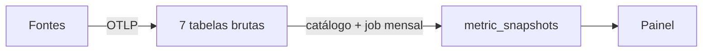

# BNP Métricas — Base Central de Métricas

## O que é este repositório
Plataforma **agnóstica de vendor** para centralizar e servir as métricas da BNP.
Recebe eventos de ferramentas de trabalho, suporte, produto e negócio (Asana, Azure
DevOps, GitHub, Clarity, Milvus, Forms, produtos...) via webhooks/OTLP, grava em
TimescaleDB de forma **append-only**, deriva métricas por um **catálogo semântico** e
serve **snapshots mensais versionados** a um painel.

Este repo segue a **RFC-0001** (arquitetura de contexto para IA). Stack: **Python**.

## Estrutura do Monorepo
- `apps/ingestion/` — Camada 1: webhooks + receiver OTLP → tabelas brutas ([CLAUDE.md](apps/ingestion/CLAUDE.md))
- `apps/api/` — Camadas 2 e 3: catálogo, cálculo de snapshots e API de serving ([CLAUDE.md](apps/api/CLAUDE.md))
- `apps/ui/` — Painel (frontend, futuro) ([CLAUDE.md](apps/ui/CLAUDE.md))
- `docs/ai/` — Contexto estruturado para IA (o "cérebro" que guia os agentes)
- `docs/reference/` — Modelo de dados e a RFC-0001
- `platform/` — IaC e runbooks (operação)
- `tasks/` — Método de planejamento/execução em séries de tasks

## Context Loading (leia sob demanda — nunca tudo de uma vez)
- **Sempre**: este `CLAUDE.md` → o `apps/{app}/CLAUDE.md` do app em que for mexer
- **Entender o sistema** → [docs/ai/PROJECT_CONTEXT.md](docs/ai/PROJECT_CONTEXT.md)
- **Linguagem/domínio, antes de modelar dados ou métricas** → [docs/ai/PROJECT_DOMAIN_MAP.md](docs/ai/PROJECT_DOMAIN_MAP.md)
- **Antes de QUALQUER alteração de código** → [docs/ai/PROJECT_RISK_REGISTER.md](docs/ai/PROJECT_RISK_REGISTER.md)
- **Procedimento de uma tarefa-tipo** → [docs/ai/PROJECT_PLAYBOOK.md](docs/ai/PROJECT_PLAYBOOK.md)
- **Deploy/ops** → [platform/runbooks/](platform/runbooks/)
- **DDL / semântica das métricas** → [docs/reference/modelo-dados-metricas-bnp.md](docs/reference/modelo-dados-metricas-bnp.md)

## Risk Awareness (o que exige cuidado — detalhe no RISK_REGISTER)
- **Append-only é inviolável**: nada de UPDATE/DELETE em tabelas brutas nem em `metric_snapshots`. Correção = evento compensatório / novo snapshot.
- **Idempotência**: todo evento tem `event_id` determinístico + `ON CONFLICT DO NOTHING`. Não quebrar a regra de geração do hash.
- **Envelope compartilhado**: toda tabela bruta carrega as 7 colunas-base. `source` é coluna, nunca tabela — agnóstico a vendor.

## Security Reminders (nunca violar)
- `ASANA_TOKEN` e demais credenciais **nunca** commitados — só via env/secret.
- Validação de assinatura HMAC do webhook (`X-Hook-Signature`) ainda **não** implementada — obrigatória antes de produção.
- `payload` bruto pode conter dados pessoais — tratar como sensível.

## Auto-documentação
Ao mudar a estrutura (nova fonte, nova tabela bruta, nova métrica no catálogo, nova
invariante), atualize os docs em `docs/ai/` — veja a tabela de auto-documentação na
RFC-0001 §5.8. **Nunca altere um doc de contexto sem lê-lo por completo antes.**

## References
- [RFC-0001 — AI Context Architecture](docs/reference/RFC-0001-AI-Context-Architecture.md)
- [Modelo de Dados](docs/reference/modelo-dados-metricas-bnp.md)
- [PROJECT_CONTEXT](docs/ai/PROJECT_CONTEXT.md) · [PLAYBOOK](docs/ai/PROJECT_PLAYBOOK.md) · [DOMAIN_MAP](docs/ai/PROJECT_DOMAIN_MAP.md) · [RISK_REGISTER](docs/ai/PROJECT_RISK_REGISTER.md)
