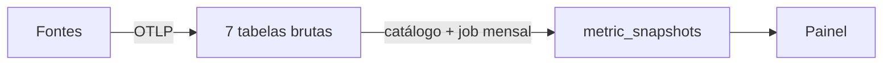

# BNP Métricas

Plataforma agnóstica para **centralizar e servir as métricas da BNP** — de entrega e
produtividade a suporte, experiência e negócio — a partir de qualquer ferramenta,
agrupadas pela **natureza do dado** e não pelo vendor.

## Como funciona

Fontes (Asana, Azure DevOps, GitHub, Clarity, Milvus, Forms, produtos...) emitem
eventos que entram via **webhook/OTLP**, são gravados **append-only** no TimescaleDB
em 7 tabelas brutas, derivados em métricas por um **catálogo semântico**, e servidos
como **snapshots mensais versionados** a um painel.

## Stack

Python · FastAPI · OpenTelemetry (OTLP/HTTP) · asyncpg · TimescaleDB (PostgreSQL + hypertables)

## Estado atual

Camada 1 parcial: `task_events` recebendo Asana via webhook. Detalhe do protótipo em
[docs/explanation/estado-atual-prototipo.md](docs/explanation/estado-atual-prototipo.md).

## Navegação

- **Modelo de dados** → [docs/reference/modelo-dados-metricas-bnp.md](docs/reference/modelo-dados-metricas-bnp.md)
- **Arquitetura de contexto p/ IA (RFC-0001)** → [docs/reference/RFC-0001-AI-Context-Architecture.md](docs/reference/RFC-0001-AI-Context-Architecture.md)
- **Contexto para agentes de IA** → começa em [CLAUDE.md](CLAUDE.md)
- **Documentação** (Diátaxis) → [docs/](docs/)
