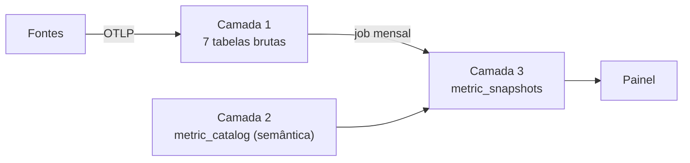

# PROJECT_CONTEXT — Base Central de Métricas BNP

> Sumário LLM-ready do sistema. Leia isto para entender o todo antes de mergulhar num app.
> Camada **Structural** do modelo de contexto (RFC-0001 §4.3).

## System Overview
Plataforma agnóstica de vendor que centraliza e serve as métricas da BNP. Eventos de
qualquer ferramenta entram via webhook/OTLP, são gravados append-only no TimescaleDB
(7 tabelas brutas agrupadas pela **natureza do dado**), derivados em métricas por um
catálogo semântico, e servidos como snapshots mensais versionados a um painel.

## Tech Stack
| Camada | Tecnologia |
|---|---|
| Linguagem | Python 3.13 |
| Web/API | FastAPI + uvicorn |
| Transporte de eventos | OpenTelemetry / OTLP-HTTP (Protobuf) |
| Banco | TimescaleDB (PostgreSQL 18 + hypertables), acesso via `asyncpg` |
| Túnel dev | ngrok |

> **Nota sobre a RFC-0001:** adotamos a filosofia de contexto-IA e a estrutura de repo
> da RFC, mas **não** a §7 (backend .NET / FastEndpoints / REPR) — esta plataforma é Python.

## Architecture Pattern
Monorepo. Pipeline de 3 camadas de dados (append-only nas pontas):

Dois grãos de dado bruto: **evento** (fatos discretos correlacionados — lead time,
MTTR) e **medição** (amostra periódica já agregada — sessões/dia).

## App Map
| App | Camada | Responsabilidade | Estado |
|---|---|---|---|
| `apps/ingestion/` | 1 | Webhook adapters + receiver OTLP → tabelas brutas | Protótipo parcial (Asana → `task_events`) |
| `apps/api/` | 2 e 3 | `metric_catalog`, job de cálculo mensal (snapshots), API de serving | Não implementado |
| `apps/ui/` | — | Painel que consome snapshots | Não implementado |

> Decomposição-alvo, **reversível**. Se a separação ingestion/api provar prematura,
> colapsam num único app Python. Ao mudar, atualizar este mapa e os `CLAUDE.md`.

## Key Invariants (resumo — detalhe em RISK_REGISTER)
1. **Append-only estrito** em tabelas brutas e `metric_snapshots`.
2. **Idempotência** por `event_id` determinístico + `ON CONFLICT DO NOTHING`.
3. **Envelope compartilhado** (7 colunas-base) em toda tabela bruta.
4. **Agnóstico a vendor**: `source` é coluna, não tabela.
5. **owner obrigatório** por métrica no catálogo.
6. **Snapshots versionados** por `formula_version` — recálculo anexa, não sobrescreve.

## Navigation
- Domínio/linguagem → [PROJECT_DOMAIN_MAP.md](PROJECT_DOMAIN_MAP.md)
- Guardrails antes de escrever código → [PROJECT_RISK_REGISTER.md](PROJECT_RISK_REGISTER.md)
- Procedimentos → [PROJECT_PLAYBOOK.md](PROJECT_PLAYBOOK.md)
- DDL completo → [../reference/modelo-dados-metricas-bnp.md](../reference/modelo-dados-metricas-bnp.md)
