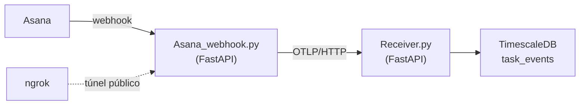

# Estado atual — protótipo de ingestão (Python)

> Documentação **humana** (explanation). Descreve o protótipo que já roda, suas decisões
> e limitações. Para *como operar*, ver o [runbook](../../platform/runbooks/operations/operar-prototipo-local.md).

## O que existe hoje
Implementa a **Camada 1 (parcial)** do modelo de dados: a tabela `task_events`
alimentada pelo **Asana** via webhook. Demais tabelas e as Camadas 2 e 3 não existem.

## Arquitetura

- **`Asana_webhook.py`** — recebe eventos do Asana, enriquece via API (nome/dono,
  status, prioridade), calcula `from_status`/`to_status` consultando o próprio banco,
  e emite como métrica via SDK OpenTelemetry. Responde 200 imediatamente e processa em
  background (`BackgroundTasks`); reaproveita o `MeterProvider`; chamadas HTTP síncronas
  rodam em threads (`asyncio.to_thread`).
- **`Receiver.py`** — recebedor OTLP (no lugar do Collector oficial). Decodifica o
  Protobuf, valida `service.owner`/`service.natureza`, roteia para a tabela e persiste
  via `asyncpg` com idempotência (`ON CONFLICT (event_id, occurred_at) DO NOTHING`).

**Por que não o OTel Collector oficial:** o exporter de PostgreSQL/TimescaleDB não é
componente oficial do `opentelemetry-collector-contrib`; usá-lo exigiria compilar um
Collector Go customizado. Um receiver OTLP próprio fala o mesmo protocolo (OTLP/HTTP,
Protobuf) sem essa complexidade.

## Mapeamento Asana → task_events
| Campo do modelo | Origem no Asana |
|---|---|
| `task_id` | GID da tarefa, vem no próprio evento |
| `event_type` | Derivado: `added`→`created`; `completed` mudou→`done`; "Progresso da tarefa" mudou→`status_changed`; demais→`changed` |
| `priority` | Custom field "Prioridade" (busca complementar via API) |
| `status` / `to_status` | Custom field "Progresso da tarefa" (busca complementar via API) |
| `from_status` | **Não vem no evento** — calculado do último `status` conhecido da `task_id` na tabela |
| `payload` | Evento bruto original |

**Idempotência:** `event_id` = `SHA-256` de `source|task_id|event_type|occurred_at`.
Reentregas do Asana geram o mesmo `event_id` → `ON CONFLICT DO NOTHING` não duplica.

## Limitações conhecidas
- Roda na máquina de dev; se desligar, a ingestão para. ngrok troca URL a cada reinício.
- HMAC (`X-Hook-Signature`) não validado — recomendado antes de produção.
- `work_item_type`, `value_tag`, `tested`, `environment_found` ficam NULL (sem custom field).
- Azure DevOps ainda não migrado para `task_events` (protótipo anterior em formato diferente).
