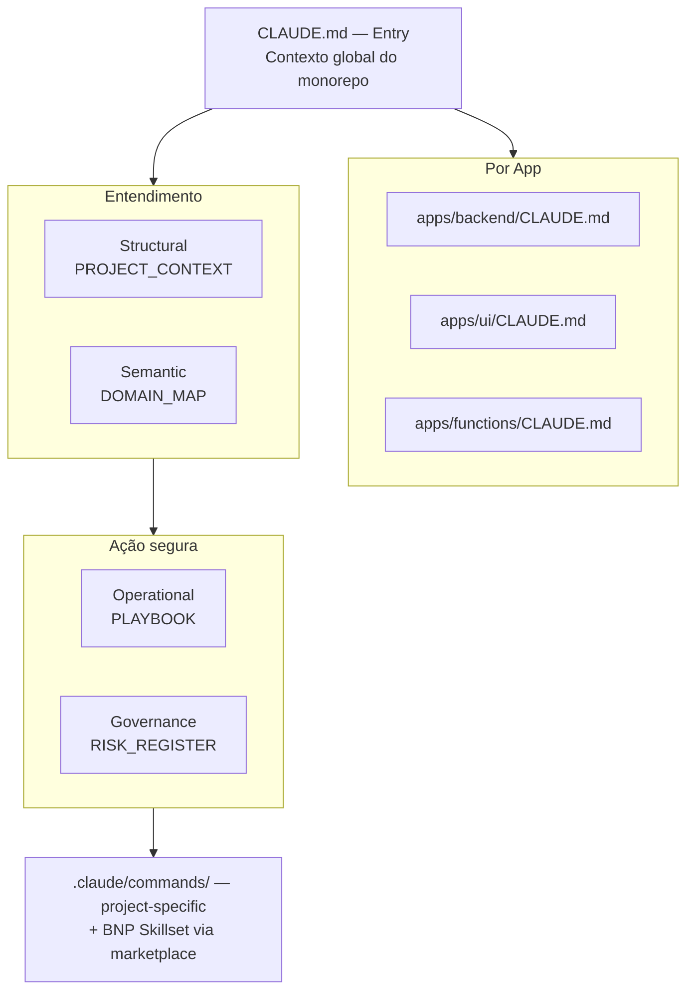
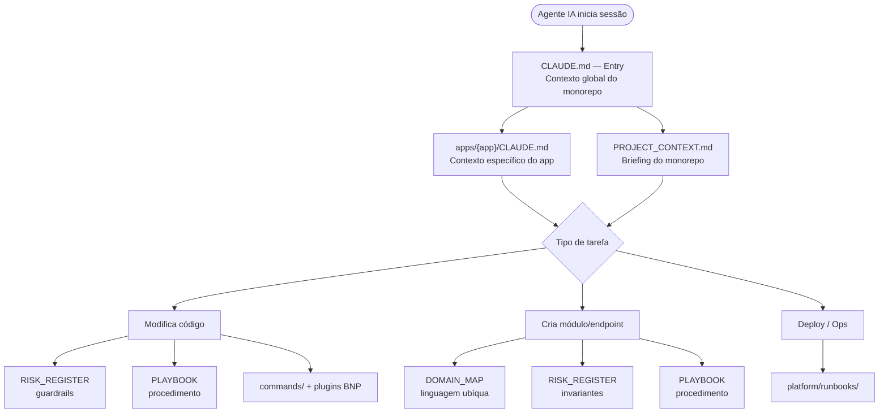
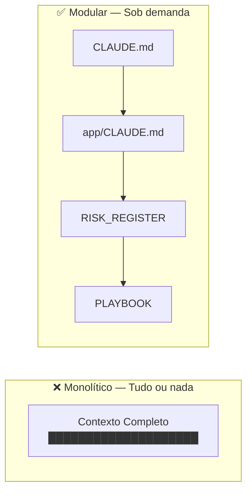

# RFC-0001 — Monorepo Structure, AI Context Architecture & Development Platform Standards

| Campo        | Valor                                        |
|--------------|----------------------------------------------|
| **RFC**      | 0001                                         |
| **Título**   | Monorepo Structure, AI Context Architecture & Development Platform Standards |
| **Status**   | Accepted                                     |
| **Data**     | 2026-02-19                                   |
| **Revisão**  | 2026-03-25                                   |
| **Autores**  | Engineering & Architecture Team              |
| **Audiência**| Engineering, Architecture, DevOps, Leadership|

---

## Índice

1. [Abstract](#1-abstract)
2. [Motivation](#2-motivation)
3. [Repository Structure — Visão Geral](#3-repository-structure--visão-geral)
4. [Design Principles](#4-design-principles)
5. [Specification — AI Layer](#5-specification--ai-layer)
6. [Specification — Complementary Layers](#6-specification--complementary-layers)
7. [Backend Architecture — REPR + Monólito Modular](#7-backend-architecture--repr--monólito-modular)
   - 7A. [Regras de Fronteira entre Módulos (INVIOLÁVEIS)](#7a-regras-de-fronteira-entre-módulos-invioláveis)
   - 7B. [Evolução do Domínio — Behavioral Design Patterns](#7b-evolução-do-domínio--behavioral-design-patterns)
8. [Context Flow — Como a IA Resolve Contexto](#8-context-flow--como-a-ia-resolve-contexto)
9. [Rationale — Por que Modular?](#9-rationale--por-que-modular)
10. [Governance](#10-governance)
11. [Expected Benefits](#11-expected-benefits)
12. [Migration Path](#12-migration-path)
13. [Decision](#13-decision)
14. [References](#14-references)
15. [Approval](#approval)

---

## 1. Abstract

Este RFC define os padrões de estrutura e desenvolvimento assistido por IA para repositórios monorepo da BNP. Estabelece:

- **Claude Code como plataforma padrão** de desenvolvimento assistido por IA em toda a organização
- **Estrutura de diretórios canônica** para todo novo repositório
- **Hierarquia de `CLAUDE.md`** — contexto modular em múltiplos níveis do repositório
- **Plugin System** via `.claude/settings.json` + marketplace `BNPTI/claude-skillset`
- **Documentação estruturada** por necessidade do leitor
- **Documentos de contexto AI** (`docs/ai/`) otimizados para consumo por LLMs
- **Guardrails de governança** via risk registers e documentos de compliance
- **Monólito Modular com Physical Boundaries** — cada módulo é um `.csproj` auto-contido
- **Auto-documentação pela IA** — a IA atualiza documentos de contexto conforme o código evolui

O objetivo é garantir que qualquer agente Claude operando neste repositório tenha contexto estruturado, previsível e seguro — sem depender de injeção massiva de tokens — e que todos os projetos sigam padrões consistentes de estrutura, qualidade e plataforma.

---

## 2. Motivation

### 2.1 Problema

Modelos de linguagem são stateless. Em cada interação, a IA parte do zero e depende exclusivamente do contexto injetado no prompt. Sem estrutura, isso causa:

| Risco                      | Consequência                                                     |
|----------------------------|------------------------------------------------------------------|
| Ausência de mapa do repo   | IA navega cegamente, gera código no lugar errado                 |
| Sem invariantes explícitas | Quebra de regras de negócio (ex.: máquina de estados, validação) |
| Sem política de segurança  | Modificações em módulos críticos sem revisão humana              |
| Contexto monolítico        | Custo de tokens alto, risco de alucinação por ruído              |
| Sem padrão de código       | Inconsistência entre contribuições humanas e IA                  |
| Skills desconexas          | Cada projeto reinventa padrões que deveriam ser compartilhados   |

### 2.2 Motivação

Precisamos de **seleção determinística de contexto**, **guardrails explícitos** e **skills organizacionais compartilhadas** para que:

- A IA saiba *onde* está no repositório
- A IA saiba *o que* cada módulo faz
- A IA saiba *como* modificar o sistema de forma segura
- A IA saiba *o que nunca deve ser violado*
- Skills de code, gitops, QA, platform e design sejam consistentes em todos os projetos

### 2.3 Objetivos Estratégicos

Quatro objetivos guiam todas as decisões arquiteturais:

1. Todo membro do time consiga entender a estrutura do monorepo, independente de seu background técnico
2. Os módulos possam ser extraídos em microserviços sem que a aplicação quebre
3. O negócio diga como o software deve ser e não o contrário
4. Que se possa adaptar e mudar comportamentos de um jeito rápido

---

## 3. Repository Structure — Visão Geral

A estrutura canônica para todo repositório que siga este padrão:

```
repo-root/
│
├── CLAUDE.md                          # Ponto de entrada + contexto global do monorepo
│
├── .claude/                           # Configuração Claude Code do projeto
│   ├── settings.json                  # Plugins BNP + marketplace
│   └── commands/                      # Slash commands específicos do projeto
│
├── apps/                              # Aplicações do monorepo
│   ├── backend/                       # Lógica de negócio — API + Workers
│   │   ├── CLAUDE.md                  # Contexto específico do backend
│   │   ├── src/
│   │   │   ├── Produto.API/           # Host fino — Program.cs + Middleware + Extensions
│   │   │   └── Modules/               # Módulos DDD auto-contidos
│   │   │       ├── Core/              # Diferenciadores de negócio
│   │   │       ├── Supporting/        # Suporte ao core
│   │   │       ├── Generic/           # Commodity
│   │   │       └── Shared/            # Shared Kernel
│   │   └── workers/                   # Workers/Jobs opcionais — apps separadas, deploy independente
│   │       └── Produto.Workers/       # Cada worker = 1 .csproj, mesmo solution
│   ├── ui/
│   │   ├── CLAUDE.md                  # Contexto específico do UI
│   │   ├── public/src/
│   │   ├── admin/src/
│   │   └── mobile/src/
│   ├── ai/
│   │   └── CLAUDE.md
│   └── functions/
│       └── CLAUDE.md
│
├── docs/                              # Documentação
│   ├── tutorials/                     # Aprender fazendo (passo a passo)
│   ├── how-to/                        # Resolver problemas práticos (como?)
│   ├── reference/                     # Consultar detalhes técnicos
│   ├── explanation/                   # Entender conceitos (por quê?)
│   ├── ai/                            # Contexto AI-specific
│   │   ├── PROJECT_CONTEXT.md
│   │   ├── PROJECT_PLAYBOOK.md
│   │   ├── PROJECT_DOMAIN_MAP.md
│   │   └── PROJECT_RISK_REGISTER.md
│   └── architecture/
│       ├── overview.md
│       └── diagrams/
│
└── platform/                          # Plataforma: IaC, runbooks
    ├── iac/                           # Infrastructure as Code
    │   ├── architecture/              # Documentação de infraestrutura
    │   │   ├── overview.md            # Descrição do design de infraestrutura
    │   │   └── diagrams/              # Diagramas de infraestrutura
    │   └── terraform/                 # Definições Terraform
    │       ├── modules/               # Módulos reutilizáveis — nunca aplicados diretamente
    │       │   ├── azure/             # Módulos de recursos Azure
    │       │   └── grafana/           # Módulos de recursos Grafana
    │       ├── environments/          # Root modules por ambiente
    │       │   ├── dev/
    │       │   ├── staging/
    │       │   └── prod/
    │       └── observability/         # Root module para Grafana (consome modules/grafana/)
    └── runbooks/                      # Procedimentos operacionais
        ├── incident/                  # Procedimentos de incidentes
        ├── operations/                # Operações rotineiras
        └── releases/                  # Checklists de deploy e rollback
```

### 3.1 Separação de Responsabilidades por Diretório

| Diretório                | Responsabilidade                                          | Consumidor Principal |
|--------------------------|-----------------------------------------------------------|----------------------|
| `CLAUDE.md`              | Ponto de entrada + contexto global do monorepo            | IA (Claude Code)     |
| `apps/*/CLAUDE.md`       | Contexto específico de cada aplicação                     | IA                   |
| `.claude/settings.json`  | Plugins BNP habilitados + configuração do marketplace     | IA (Claude Code)     |
| `.claude/commands/`      | Slash commands específicos do projeto                     | IA (Claude Code)     |
| `apps/backend/`          | Lógica de negócio — API + Workers com deploy independente | Humano + IA          |
| `apps/ui/`               | Frontend(s) — public, admin, mobile                       | Humano + IA          |
| `apps/ai/`               | Serviços de IA (prompts, chains, embeddings)              | Humano + IA          |
| `apps/functions/`        | Serverless / Workers                                      | Humano + IA          |
| `docs/tutorials/`        | Aprender fazendo — guias passo a passo                    | Humano               |
| `docs/how-to/`           | Resolver problemas práticos                               | Humano               |
| `docs/reference/`        | Referência técnica consultável                            | Humano               |
| `docs/explanation/`      | Entendimento conceitual e decisões de design              | Humano               |
| `docs/ai/`               | Documentação de contexto otimizada para LLMs              | IA                   |
| `docs/architecture/`     | Visão geral e diagramas de arquitetura                    | Humano + IA          |
| `platform/iac/`          | Infrastructure as Code (Terraform, architecture docs)     | DevOps + IA          |
| `platform/runbooks/`     | Procedimentos operacionais e de incidente                 | DevOps + IA          |

---

## 4. Design Principles

### 4.1 Claude Code como Plataforma Padrão

Claude Code é a plataforma oficial de desenvolvimento assistido por IA da BNP. Todos os projetos devem:

- Ter `CLAUDE.md` na raiz com contexto do repositório
- Ter `CLAUDE.md` em cada diretório de aplicação (`apps/*/`)
- Configurar `.claude/settings.json` com os plugins BNP habilitados
- Usar o marketplace `BNPTI/claude-skillset` como fonte de skills organizacionais

**Consequência:** Não há necessidade de manter compatibilidade genérica com outros instrumentos de agente de IA. O contexto é estruturado para Claude Code nativamente.

### 4.2 Separation of Concerns

Cada tipo de documentação tem um proprietário e um objetivo distinto:

| Tipo de Documentação    | Organização              | Propósito                          |
|-------------------------|--------------------------|------------------------------------|
| Documentação humana     | Diataxis (tipos diretos) | Onboarding, referência, tutoriais  |
| Documentação AI         | Este RFC                 | Contexto estruturado para LLMs     |
| Runbooks operacionais   | Runbook Pattern          | Procedimentos de incidente e ops   |
| Infraestrutura          | IaC                      | Definição declarativa de infra     |

**Regra:** Documentação para humanos e para IA NUNCA devem ser misturadas no mesmo arquivo.

### 4.3 Layered Context Model

O contexto que a IA consome é organizado em camadas. Cada camada responde a uma pergunta:

| Camada          | Pergunta que Responde                     | Documento Responsável        |
|-----------------|-------------------------------------------|------------------------------|
| **Entry**       | *O que é este repositório?*               | `CLAUDE.md` (raiz)           |
| **App-level**   | *O que este app específico faz?*          | `apps/*/CLAUDE.md`           |
| **Structural**  | *Como o sistema está organizado?*         | `docs/ai/PROJECT_CONTEXT.md` |
| **Semantic**    | *O que cada parte significa?*             | `PROJECT_DOMAIN_MAP.md`      |
| **Operational** | *Como modificar o sistema com segurança?* | `PROJECT_PLAYBOOK.md`        |
| **Governance**  | *O que nunca deve ser violado?*           | `PROJECT_RISK_REGISTER.md`   |



### 4.4 Minimal Prompt Injection

- **Não** injetar o repositório inteiro no contexto
- **Sim** usar sumários compactos, risk registers e playbooks orientados a tarefa
- O `CLAUDE.md` da raiz atua como roteador: a IA lê ele primeiro e depois carrega apenas os documentos relevantes para a tarefa

### 4.5 Monorepo Scalability

A estrutura suporta:

- Múltiplas aplicações (`backend/`, `ui/`, `ai/`, `functions/`) cada uma com seu `CLAUDE.md`
- Platform unificada (`platform/`) com IaC e runbooks, ownership claro do time de SRE/DevOps
- Skills compartilhadas via marketplace (`BNPTI/claude-skillset`)
- Commands específicos por projeto (`.claude/commands/`)
- Evolução independente de subsistemas

---

## 5. Specification — AI Layer

Esta seção detalha cada componente da camada de IA com sua estrutura, conteúdo esperado e justificativa.

### 5.1 `CLAUDE.md` — Ponto de Entrada e Contexto Global

**Localização:** `repo-root/CLAUDE.md`

**Propósito:** Claude Code lê automaticamente o `CLAUDE.md` na raiz do repositório ao iniciar uma sessão. Este arquivo é o **ponto de entrada principal**: descreve o monorepo, orienta o contexto inicial e aponta para os documentos e apps relevantes.

**Conteúdo esperado:**

```markdown
# [Nome do Projeto]

## O que é este repositório
Descrição em 2-3 frases do que o sistema faz.

## Estrutura do Monorepo
- `apps/backend/` — Backend ([link para apps/backend/CLAUDE.md])
- `apps/ui/` — Frontend ([link para apps/ui/CLAUDE.md])
- `platform/` — IaC, runbooks
- `docs/ai/` — Contexto estruturado para IA

## Context Loading
- Para tarefas de código → ler CLAUDE.md do app relevante + docs/ai/PROJECT_PLAYBOOK.md
- Para modelagem → ler docs/ai/PROJECT_DOMAIN_MAP.md
- Para deploy/ops → ler platform/runbooks/

## Risk Awareness
Módulos de alto risco que exigem revisão antes de modificação.

## Security Reminders
Regras que nunca devem ser violadas.

## References
- [PROJECT_CONTEXT](docs/ai/PROJECT_CONTEXT.md)
- [PROJECT_PLAYBOOK](docs/ai/PROJECT_PLAYBOOK.md)
- [PROJECT_DOMAIN_MAP](docs/ai/PROJECT_DOMAIN_MAP.md)
- [PROJECT_RISK_REGISTER](docs/ai/PROJECT_RISK_REGISTER.md)
```

**Cada diretório relevante** também deve ter seu próprio `CLAUDE.md` com contexto específico. Claude Code lê automaticamente o `CLAUDE.md` do diretório de trabalho atual, de forma que ao navegar para `apps/backend/`, o contexto específico do backend é carregado automaticamente.

### 5.2 `.claude/` — Configuração do Projeto

**Localização:** `repo-root/.claude/`

**Propósito:** Configura o comportamento do Claude Code para o projeto: plugins habilitados, marketplace de skills e comandos específicos.

#### 5.2.1 `settings.json` — Plugin Configuration

Todo projeto **obrigatoriamente** deve ter `.claude/settings.json` configurando os plugins BNP habilitados:

```json
{
  "extraKnownMarketplaces": {
    "bnp-skillset": {
      "source": {
        "source": "github",
        "repo": "BNPTI/claude-skillset"
      }
    }
  },
  "enabledPlugins": {
    "bnp-code@bnp-skillset": true,
    "bnp-gitops@bnp-skillset": true,
    "bnp-product@bnp-skillset": true,
    "bnp-quality@bnp-skillset": true
  }
}
```

**Plugins disponíveis no marketplace `BNPTI/claude-skillset`:**

| Plugin              | Chapter       | Responsabilidade                                                |
|---------------------|---------------|-----------------------------------------------------------------|
| `bnp-code`          | Engineering   | Coding style, language policy, naming conventions, arquitetura  |
| `bnp-gitops`        | Engineering   | Conventional commits, GitHub CLI, branching strategy            |
| `bnp-quality`       | Quality       | Ferramentas de garantia de qualidade, coverage, contract testing|
| `bnp-product`       | Product       | Descoberta e classificação de features, priorização, PRDs       |
| `bnp-platform`      | Platform      | IaC, análise de infraestrutura, pipelines                       |
| `bnp-design`        | Design        | Prototipação, acessibilidade, design system                     |

O projeto habilita apenas os plugins relevantes para seu contexto. Cada chapter da estrutura Spotify da BNP possui seus próprios plugins. Projetos também podem ter **skills próprias** para resolver problemas específicos do contexto.

**Skills e agentes reutilizáveis** são fornecidos exclusivamente via plugins de organização do Claude (`BNPTI/claude-skillset`). Não há diretório local de skills — todo compartilhamento acontece via marketplace.

#### 5.2.2 `commands/` — Slash Commands do Projeto

**Localização:** `.claude/commands/`

Comandos específicos do projeto implementados como arquivos `.md`. São complementares aos plugins do marketplace — resolvem automações ou fluxos únicos do contexto do projeto.

```
.claude/
├── settings.json
└── commands/
    ├── scaffold-module.md           # Criar estrutura de novo módulo
    ├── run-migrations.md            # Executar migrations de banco
    └── seed-dev.md                  # Popular ambiente dev com dados
```

### 5.3 `apps/*/CLAUDE.md` — Contexto por Aplicação

**Localização:** `apps/{app-name}/CLAUDE.md`

**Propósito:** Contexto específico de cada aplicação do monorepo. Claude Code carrega automaticamente ao trabalhar dentro do diretório da aplicação.

**Conteúdo esperado:**

| Seção                 | Descrição                                                    |
|-----------------------|--------------------------------------------------------------|
| App Overview          | O que este app faz, em 2-3 frases                            |
| Tech Stack            | Linguagens, frameworks e dependências específicas deste app  |
| Architecture Pattern  | Padrão interno do app (REPR + Monólito Modular, etc.)        |
| Directory Map         | Mapa dos diretórios internos e responsabilidade de cada um   |
| Key Invariants        | Regras que nunca devem ser violadas dentro deste app         |
| Auto-documentação     | Instruções para atualizar docs/ai/ conforme o código evolui  |
| Playbook Reference    | Link para o playbook do app (se existir)                     |

**Instrução obrigatória no `CLAUDE.md` do backend:**

```markdown
## Auto-documentação

Ao modificar a estrutura do backend (novos módulos, novos agregados, novos IntegrationContracts,
alterações em state machines ou invariantes), atualize os documentos de contexto relevantes
em `docs/ai/`. Consulte a tabela de auto-documentação na RFC-0001 para saber qual documento
atualizar em cada situação.

Nunca altere documentos de contexto sem antes lê-los por completo.
```

### 5.4 `docs/ai/PROJECT_CONTEXT.md` — Context Summary

**Localização:** `docs/ai/PROJECT_CONTEXT.md`

**Propósito:** Sumário compacto e LLM-ready da arquitetura do monorepo como um todo. É o "briefing" macro que a IA recebe para entender o sistema rapidamente.

**Conteúdo esperado:**

| Seção                 | Descrição                                          |
|-----------------------|----------------------------------------------------|
| System Overview       | O que o sistema faz, em 2-3 frases                 |
| Tech Stack            | Linguagens, frameworks, cloud, banco de dados      |
| Architecture Pattern  | Monorepo, DDD, CQRS, Monólito Modular, etc.       |
| Key Invariants        | Regras que nunca devem ser violadas                |
| Module Map            | Mapa de `apps/` com responsabilidade de cada módulo|
| Navigation References | Links para playbook, risk register, domain map     |

### 5.5 `docs/ai/PROJECT_RISK_REGISTER.md` — Registro de Riscos

**Localização:** `docs/ai/PROJECT_RISK_REGISTER.md`

**Propósito:** Documento de governança que define o que a IA **não pode** fazer sem supervisão.

**Conteúdo esperado:**

| Seção                    | Descrição                                                      |
|--------------------------|----------------------------------------------------------------|
| Critical Invariants      | Regras de negócio invioláveis (ex.: máquina de estados)        |
| High-Impact Modules      | Módulos que exigem review antes de qualquer alteração          |
| State Machine Rules      | Transições válidas e inválidas de estados de domínio           |
| Dependency Risks         | Dependências frágeis ou com breaking changes frequentes        |
| Technical Debt           | Áreas do código com débito técnico conhecido                   |
| Security Considerations  | Secrets, auth flows, endpoints sensíveis                       |

**Exemplo de entrada:**

```markdown
### Critical Invariant: Order State Machine

- DRAFT → SUBMITTED → APPROVED → FULFILLED → CLOSED
- Transition FULFILLED → DRAFT is FORBIDDEN
- Any state change MUST emit a domain event
- Violation = data corruption risk
```

### 5.6 `docs/ai/PROJECT_PLAYBOOK.md` — Guias de Execução

**Localização:** `docs/ai/PROJECT_PLAYBOOK.md` (monorepo) + `apps/{app}/PROJECT_PLAYBOOK.md` (por app, quando necessário)

**Obrigatoriedade:** A **presença do arquivo é obrigatória** desde o scaffold do projeto. O conteúdo é **evolutivo** — começa como template básico e cresce conforme o time identifica padrões e dificuldades recorrentes.

**Estrutura:**
- `docs/ai/PROJECT_PLAYBOOK.md` — playbook central do monorepo
- `apps/{app}/PROJECT_PLAYBOOK.md` — playbook específico do app (opcional por app, obrigatório no nível central)

**Conteúdo esperado (tarefas-tipo):**

| Tarefa                   | Conteúdo do Playbook                             |
|--------------------------|--------------------------------------------------|
| Adicionar novo módulo    | Criar .csproj, DbContext, DependencyInjection, registrar no host |
| Adicionar endpoint       | Endpoint.cs, Models.cs, Data.cs opcional         |
| Modificar prompt de IA   | Onde ficam os prompts, como testar, rollback      |
| Adicionar modelo de dados| Entity, migration, agregado                       |
| Adicionar worker/function| Trigger, handler, retry policy, monitoring        |
| Debug de failure         | Logs, traces, runbooks de incidentes              |

**Playbook: Adicionar Endpoint**

```markdown
## Playbook: Adicionar Endpoint

### Pré-condições
- [ ] CLAUDE.md do backend carregado
- [ ] RISK_REGISTER verificado para o módulo

### Steps
1. Identificar o módulo correto em `Modules/{Core|Supporting|Generic}/`
2. Criar pasta em `Endpoints/{NomeDaAção}/`
3. Criar `Models.cs` com Request, Validator (FluentValidation) e Response
4. Criar `Endpoint.cs` com rota, autorização e HandleAsync
5. Se a query for complexa, extrair para `Data.cs` (classe estática)
6. Se o endpoint precisa de dados de outro módulo, usar IntegrationContract no HandleAsync
7. Rodar testes de integração

### Checklist Pós-Execução
- [ ] Testes passando
- [ ] Nenhuma invariante violada (verificar RISK_REGISTER)
- [ ] Data.cs não referencia IntegrationContracts
- [ ] Commit segue conventional-commit
- [ ] Se novo módulo/agregado/contrato → docs/ai/ atualizado
```

**Playbook: Criar Novo Módulo**

```markdown
## Playbook: Criar Novo Módulo

### Pré-condições
- [ ] Decisão de produto sobre classificação (Core/Supporting/Generic)
- [ ] DOMAIN_MAP consultado para linguagem ubíqua

### Steps
1. Criar `.csproj` em `Modules/{Core|Supporting|Generic}/Produto.{Módulo}/`
2. Adicionar referência a `Produto.Shared.csproj` (e APENAS a este)
3. Criar `Persistence/{Módulo}DbContext.cs`
4. Criar `DependencyInjection.cs` para registro de serviços
5. Registrar o módulo no `Program.cs` do host (API ou Worker)
6. Criar pasta do primeiro agregado com entidade raiz
7. Criar primeiro endpoint em `Endpoints/`

### Checklist Pós-Execução
- [ ] .csproj referencia APENAS Produto.Shared
- [ ] DbContext é exclusivo do módulo
- [ ] DependencyInjection.cs registra apenas serviços do módulo
- [ ] `docs/ai/PROJECT_DOMAIN_MAP.md` atualizado com novo bounded context
- [ ] `docs/ai/PROJECT_CONTEXT.md` atualizado com module map
- [ ] `CLAUDE.md` do backend atualizado com directory map
```

### 5.7 `docs/ai/PROJECT_DOMAIN_MAP.md` — Mapa de Domínio

**Localização:** `docs/ai/PROJECT_DOMAIN_MAP.md`

**Propósito:** Glossário do domínio e mapeamento de bounded contexts. Garante que a IA use a linguagem ubíqua correta e entenda as fronteiras entre domínios.

**Conteúdo esperado:**

| Seção                | Descrição                                                  |
|----------------------|------------------------------------------------------------|
| Ubiquitous Language  | Glossário de termos do domínio com definição canônica       |
| Bounded Contexts     | Mapa de contextos delimitados e suas responsabilidades      |
| Context Relationships| Relacionamentos entre bounded contexts (upstream/downstream)|
| Aggregates           | Principais agregados e suas regras de consistência          |
| Domain Events        | Eventos de domínio publicados e consumidos por cada contexto|

### 5.8 Auto-documentação pela IA

**Princípio:** A IA é co-autora da documentação de contexto do projeto. Ao criar, modificar ou refatorar código, a IA deve atualizar os documentos afetados seguindo estas regras.

#### 5.8.1 Quando a IA DEVE atualizar documentação

| Ação realizada pela IA                     | Documento a atualizar                        |
|--------------------------------------------|----------------------------------------------|
| Criar novo módulo                          | `PROJECT_DOMAIN_MAP.md` (novo bounded context), `PROJECT_CONTEXT.md` (module map), `CLAUDE.md` do backend (directory map) |
| Criar novo endpoint                        | Nenhum (o endpoint é auto-descritivo via namespace e Summary do FastEndpoints) |
| Criar novo IntegrationContract             | `PROJECT_DOMAIN_MAP.md` (context relationships) |
| Adicionar/alterar invariante de negócio    | `PROJECT_RISK_REGISTER.md` (critical invariants) |
| Adicionar/alterar state machine            | `PROJECT_RISK_REGISTER.md` (state machine rules) |
| Introduzir novo agregado num módulo        | `PROJECT_DOMAIN_MAP.md` (aggregates) |
| Mover módulo entre Core/Supporting/Generic | `PROJECT_CONTEXT.md` (module map), `CLAUDE.md` do backend |
| Criar novo playbook ou procedimento        | `PROJECT_PLAYBOOK.md` |

#### 5.8.2 Quando a IA NÃO deve atualizar documentação

- Alterações internas a um endpoint que não mudam contratos públicos
- Refatorações que não alteram fronteiras de módulo
- Fixes de bugs que não alteram invariantes

#### 5.8.3 Formato de atualização

Ao atualizar um documento de contexto, a IA deve:

1. Ler o documento atual antes de modificar
2. Manter o formato e estilo existente
3. Adicionar a alteração na seção correta
4. Não remover informação existente sem justificativa explícita
5. Incluir um comentário no commit indicando quais documentos de contexto foram atualizados

---

## 6. Specification — Complementary Layers

### 6.1 `apps/` — Aplicações do Monorepo

```
apps/
├── backend/               # Lógica de negócio — API + Workers
│   ├── CLAUDE.md          # Contexto específico do backend
│   ├── src/
│   │   ├── Produto.API/                          # Host fino — Program.cs + Middleware + Extensions
│   │   └── Modules/                              # Módulos DDD auto-contidos
│   │       ├── Core/                             # Domínio principal — diferenciador de negócio
│   │       │   └── Produto.{Módulo}/             # Cada módulo = 1 .csproj auto-contido
│   │       │       ├── {Agregado}/               # Entidade raiz + Value Objects + Enums
│   │       │       ├── Endpoints/                # REPR — vertical slices
│   │       │       │   └── {Ação}/
│   │       │       │       ├── Endpoint.cs       # Obrigatório
│   │       │       │       ├── Models.cs         # Obrigatório (Request + Validator + Response)
│   │       │       │       └── Data.cs           # Opcional (classe estática, queries complexas)
│   │       │       ├── CommandHandlers/           # Handlers de IntegrationContracts
│   │       │       ├── Persistence/              # DbContext + EF Configurations
│   │       │       ├── Migrations/
│   │       │       ├── Infrastructure/           # Integrações externas (opcional)
│   │       │       └── DependencyInjection.cs    # Registro de serviços do módulo
│   │       ├── Supporting/                       # Suporte ao core — não é diferenciador
│   │       │   └── Produto.{Módulo}/
│   │       ├── Generic/                          # Commodity — poderia ser serviço externo
│   │       │   └── Produto.{Módulo}/
│   │       └── Shared/                           # Shared Kernel
│   │           └── Produto.Shared/
│   │               ├── Primitives/               # Entity, AggregateRoot, AuditableEntity
│   │               ├── Authorization/            # Roles, Permissions
│   │               ├── IntegrationContracts/     # Comunicação entre módulos
│   │               │   └── {MóduloProdutor}/     # Ownership: módulo que implementa o handler
│   │               ├── Tenancy/                  # Multi-tenancy (se aplicável)
│   │               └── Configuration/            # Settings compartilhados
│   ├── workers/                                  # Workers/Jobs opcionais — apps separadas
│   │   └── Produto.Workers/                      # Cada worker = 1 .csproj, deploy independente
│   └── tests/
│       └── Produto.Tests/                        # Integration tests via WebApplicationFactory
├── ui/                    # Frontend(s)
│   ├── CLAUDE.md          # Contexto específico do UI
│   ├── public/src/        # App público
│   ├── admin/src/         # Painel administrativo
│   └── mobile/src/        # App mobile
├── ai/                    # Serviços de IA (prompts, chains, embeddings)
│   └── CLAUDE.md
└── functions/             # Serverless / Workers
    └── CLAUDE.md
```

Cada módulo é um projeto `.csproj` separado e auto-contido. Essa separação garante:

- **Fronteira de compilação**: um módulo não pode acessar tipos internos de outro — o compilador barra
- **DbContext isolado**: cada módulo tem seu próprio DbContext em `Persistence/` — nunca acessa tabelas de outro módulo
- **Preparação para microserviços**: o mesmo módulo pode ser extraído para um serviço separado sem mudar a lógica interna
- **Ownership claro**: cada módulo pertence a uma squad e pode ser governado via CODEOWNERS

A classificação `Core/Supporting/Generic` é decisão de **produto** — o negócio define onde está o diferencial competitivo, e o software reflete isso na estrutura de diretórios. Essa classificação pode mudar conforme o negócio evolui; quando isso acontecer, o módulo é movido fisicamente e as referências são atualizadas.

`Produto.API/` mora em `src/` como host fino. `Produto.Workers/` mora em `workers/`, no mesmo nível de `src/` — são aplicações separadas e opcionais, cada uma com seu `.csproj` e Dockerfile, com deploy independente. Workers referenciam os módulos via project reference, compartilham domínio mas escalam separadamente. O `CLAUDE.md` do backend cobre ambos (API e Workers) porque a lógica de negócio é a mesma.

### 6.2 `docs/` — Documentação

```
docs/
├── tutorials/          # Aprender fazendo — guias passo a passo
├── how-to/             # Resolver problemas práticos (como?)
├── reference/          # Consultar detalhes técnicos
├── explanation/        # Entender conceitos e decisões (por quê?)
├── ai/                 # Contexto otimizado para LLMs
│   ├── PROJECT_CONTEXT.md
│   ├── PROJECT_PLAYBOOK.md
│   ├── PROJECT_DOMAIN_MAP.md
│   └── PROJECT_RISK_REGISTER.md
└── architecture/
    ├── overview.md     # Visão geral da arquitetura
    └── diagrams/       # Diagramas C4, sequência, etc.
```

A organização das pastas de documentação segue os quatro tipos do framework Diátaxis diretamente — **sem criar um diretório wrapper** chamado `diataxis/`. A documentação humana **não** deve ser consumida como contexto primário pela IA — está otimizada para humanos.

### 6.3 `platform/` — Plataforma

```
platform/
├── iac/                           # Infrastructure as Code
│   ├── architecture/              # Documentação de infraestrutura
│   │   ├── overview.md            # Descrição do design de infraestrutura
│   │   └── diagrams/              # Diagramas de infraestrutura
│   └── terraform/                 # Definições Terraform
│       ├── modules/               # Módulos reutilizáveis — nunca aplicados diretamente
│       │   ├── azure/             # Módulos de recursos Azure (App Service, ACR, Key Vault, networking, Service Bus)
│       │   └── grafana/           # Módulos de recursos Grafana (dashboards, alert rules, datasources)
│       ├── environments/          # Root modules para infraestrutura Azure por ambiente
│       │   ├── dev/               # Development — consome modules/azure/
│       │   ├── staging/           # Staging (homolog) — consome modules/azure/
│       │   └── prod/              # Production — consome modules/azure/
│       └── observability/         # Root module para recursos Grafana — consome modules/grafana/
└── runbooks/                      # Procedimentos operacionais
    ├── incident/                  # Procedimentos de incidentes
    ├── operations/                # Operações rotineiras
    └── releases/                  # Checklists de deploy e rollback
```

**Module Consumption Pattern:**

`modules/` contém building blocks reutilizáveis. Nunca são aplicados diretamente — são sempre consumidos por um root module (`environments/` ou `observability/`).

- Para alterar **o que** um recurso faz → editar o módulo em `modules/`
- Para alterar **como** um recurso é configurado por ambiente → editar o root module em `environments/` ou `observability/`

**Validação automática:**
- IaC: `terraform validate` no CI
- Pipelines (em `.github/workflows/`): cada pipeline segue `init → plan → infracost breakdown → apply`

---

## 7. Backend Architecture — REPR + Monólito Modular

### 7.1 Contexto

A BNP adota **FastEndpoints** com o padrão **REPR (Request-Endpoint-Response)** como base para implementação de CQRS em APIs .NET. A organização do código segue **Monólito Modular com Physical Boundaries** — cada módulo é um `.csproj` auto-contido, organizado por bounded context, com DbContext isolado e comunicação entre módulos exclusivamente via IntegrationContracts.

### 7.2 Mapeamento Negócio → Código

O vocabulário de **Domain-Driven Design** mapeia diretamente para a estrutura de código:

| Business Architecture          | Código                                           | Exemplo                          |
|--------------------------------|--------------------------------------------------|----------------------------------|
| Bounded Context                | Módulo (`Produto.{Módulo}/` — .csproj separado)  | `Produto.Inventory/`             |
| Aggregate                      | Pasta no root do módulo (`{Agregado}/`)           | `InventoryBalance/`              |
| Use case / Command / Query     | Endpoint REPR (`Endpoints/{Ação}/`)              | `Endpoints/Purchase/`            |

**Exemplo — Módulo Inventory:**

```
Modules/Core/Produto.Inventory/
├── InventoryBalance/                 # Agregado
│   ├── InventoryBalance.cs
│   └── BalanceCalculator.cs
├── InventoryDocument/                # Agregado
│   ├── InventoryDocument.cs
│   ├── InventoryDocumentStatus.cs
│   ├── InventoryLine.cs
│   └── InventoryStateMachine.cs
├── Endpoints/
│   ├── Purchase/                     # Use-case = Command
│   │   ├── Endpoint.cs
│   │   ├── Models.cs
│   │   └── Data.cs
│   └── GetBalance/                   # Use-case = Query
│       ├── Endpoint.cs
│       └── Models.cs
├── CommandHandlers/
│   └── ReserveStockHandler.cs
├── Persistence/
│   └── InventoryDbContext.cs
├── Migrations/
└── DependencyInjection.cs
```

**Regra:** Um use-case = um endpoint FastEndpoints = um slice autocontido. Cada ação do sistema (command ou query CQRS) é um endpoint separado.

### 7.3 Estrutura Interna do Endpoint

Cada endpoint é composto por **dois arquivos obrigatórios** e **um opcional**:

```
Endpoints/{Ação}/
├── Endpoint.cs    # Obrigatório — orquestração, autorização, IntegrationContracts
├── Models.cs      # Obrigatório — Request + Validator + Response (mesmo arquivo)
└── Data.cs        # Opcional — classe estática com queries complexas
```

| Arquivo         | Presença    | Responsabilidade                                                              |
|-----------------|-------------|-------------------------------------------------------------------------------|
| `Endpoint.cs`   | Obrigatório | Define rota, método HTTP, autorização. Orquestra o fluxo: chama Data.cs para queries, chama IntegrationContracts para comunicação cross-módulo, monta response |
| `Models.cs`     | Obrigatório | Request (com atributos de binding), Validator (FluentValidation inline, descoberto por convenção do FastEndpoints), Response e DTOs auxiliares — tudo no mesmo arquivo |
| `Data.cs`       | Opcional    | Classe estática com métodos de acesso a dados. Acessa apenas o DbContext do próprio módulo. Quando a query é simples, o Endpoint.cs faz inline |

#### Regras de Data.cs

- Data.cs é uma **classe estática** — não é injetável, não é service layer
- Data.cs acessa **apenas** o DbContext do próprio módulo
- Data.cs **nunca** chama IntegrationContracts — isso é responsabilidade exclusiva do Endpoint.cs
- Se o endpoint precisa de dados de outro módulo, ele chama o IntegrationContract no `HandleAsync` e passa o resultado para a lógica local
- Enforcement: regra validável via DangerJS ou Roslyn analyzer no CI — `Data.cs` não pode referenciar tipos de `IntegrationContracts`

#### Mapper.cs removido — justificativa

O `mapper.cs` da estrutura anterior é substituído por mapeamento inline no Endpoint.cs. Motivos:

- O FastEndpoints já provê infraestrutura de Mapper via `Endpoint<Request, Response, Mapper>`, mas na prática a conversão é simples o suficiente para ficar no HandleAsync ou num método privado `ToResponse()` no próprio Endpoint
- Mapper como arquivo separado cria indireção sem valor para a maioria dos use-cases
- Quando a conversão for complexa, ela pode ser um método estático no Data.cs ou um método privado no Endpoint

#### test.cs removido do slice — justificativa

Testes não moram dentro da pasta do endpoint. A abordagem de teste é **integration test via FastEndpoints** usando `WebApplicationFactory`, que testa o endpoint de ponta a ponta (middleware, validação, handler, response). Os testes ficam num projeto separado `tests/` no nível do backend:

```
apps/backend/
├── src/
│   ├── Produto.API/
│   └── Modules/
├── workers/
│   └── Produto.Workers/
└── tests/
    └── Produto.Tests/             # Integration tests via WebApplicationFactory
```

**Consequência**: não se testa Data.cs isoladamente. Se o endpoint funciona, o Data.cs funciona. Unit tests de domínio ficam co-localizados com o agregado quando a lógica é complexa.

### 7.4 Estratégia de Testes

| Camada                    | Localização                          | Quando usar                                              |
|---------------------------|--------------------------------------|----------------------------------------------------------|
| Integration test do endpoint | `tests/Produto.Tests/`            | Todo endpoint — testa o slice de ponta a ponta           |
| Unit test de domínio      | Co-localizado no agregado            | Lógica complexa: state machines, cálculos, invariantes   |

**E2E** (Playwright, etc.) fica em projeto separado `tests/e2e/` quando necessário. Para a maioria dos projetos, a camada FastEndpoints já é suficiente.

### 7.5 Classificação de Domínio

Os módulos são organizados pelo tipo de domínio ao qual pertencem. **Essa classificação é decisão de produto** — o time de produto define onde está o diferencial competitivo do negócio:

| Tipo de Domínio     | Quando Usar                                                  | Quem Decide        |
|---------------------|--------------------------------------------------------------|---------------------|
| `Core/`             | Diferenciador de negócio — onde está a vantagem competitiva  | Produto + Negócio   |
| `Supporting/`       | Suporta o core mas não é diferenciador                       | Produto + Negócio   |
| `Generic/`          | Commodity — poderia ser um serviço externo ou pacote pronto  | Produto + Negócio   |

### 7.6 Escalabilidade: Projetos Pequenos

A indicação de mercado (Jimmy Bogard, Milan Jovanović) é: **Vertical Slices desde o dia 1**, independente do tamanho do projeto. Organizar por use-case é menos custoso que organizar por camada e não impede crescimento.

O que varia com o tamanho do projeto é o nível de classificação adotado:

| Fase do Projeto                        | Estrutura Recomendada                                    |
|----------------------------------------|----------------------------------------------------------|
| Pequeno (1-2 bounded contexts)         | `Modules/Produto.{Módulo}/` — sem classificar tipo       |
| Médio (3+ bounded contexts emergindo)  | Introduzir `Core/` e `Supporting/`                        |
| Grande (múltiplos times, muitos BCs)   | Classificação completa `Core / Supporting / Generic`      |

**Regra fixa independente do tamanho:** A estrutura interna do endpoint (`Endpoint.cs` + `Models.cs` + `Data.cs` opcional) é **sempre obrigatória** — garante que o projeto possa crescer sem refatoração estrutural.

**Quando migrar para classificação completa:** quando a equipe consegue responder "isso é nosso diferencial competitivo ou é suporte?" com clareza para a maioria dos módulos.

---

## 7A. Regras de Fronteira entre Módulos (INVIOLÁVEIS)

Estas regras são a base que garante baixo acoplamento e preparação para extração em microserviços.

### 7A.1 Regra de Dependência

Um módulo **nunca** referencia o `.csproj` de outro módulo. A única dependência permitida é `Produto.Shared`. Isso é enforçado pelo solution file e validável no CI.

```
✅ Produto.Inventory.csproj → referencia → Produto.Shared.csproj
✅ Produto.Poles.csproj     → referencia → Produto.Shared.csproj
❌ Produto.Poles.csproj     → referencia → Produto.Inventory.csproj  ← PROIBIDO
```

### 7A.2 Comunicação entre Módulos — IntegrationContracts

Módulos se comunicam **exclusivamente** via `ICommand<TResult>` do FastEndpoints. Contratos ficam em `Shared/Produto.Shared/IntegrationContracts/{MóduloProdutor}/`.

```
Produto.Shared/IntegrationContracts/
├── Inventory/
│   ├── ReserveStockCommand.cs          # Ação: reservar estoque
│   └── HasActiveStockQuery.cs          # Consulta: tem estoque ativo?
├── Products/
│   └── GetProductPriceQuery.cs         # Consulta: preço do produto
└── Procurement/
    └── GoodsReceivedCommand.cs         # Ação: entrada de mercadoria
```

**Ação em outro módulo (Command):**

```csharp
// Shared/IntegrationContracts/Inventory/ReserveStockCommand.cs — contrato
public class ReserveStockCommand : ICommand<ReserveStockResult>
{
    public Guid ProductVariantId { get; set; }
    public Guid WarehouseId { get; set; }
    public decimal Quantity { get; set; }
}

// Produto.Inventory/CommandHandlers/ReserveStockHandler.cs — implementação
public class ReserveStockHandler(InventoryDbContext db)
    : ICommandHandler<ReserveStockCommand, ReserveStockResult>
{
    public async Task<ReserveStockResult> ExecuteAsync(
        ReserveStockCommand cmd, CancellationToken ct)
    {
        // lógica de reserva — acessa apenas InventoryDbContext
    }
}

// No endpoint que precisa disparar (em outro módulo):
var result = await new ReserveStockCommand { ... }.ExecuteAsync(ct);
```

### 7A.3 Ownership dos IntegrationContracts

O **módulo produtor** (quem implementa o handler) é dono do contrato. O contrato mora em `Shared/IntegrationContracts/{MóduloProdutor}/`. Isso significa:

- O time dono do módulo Inventory define e mantém os contratos em `IntegrationContracts/Inventory/`
- Módulos consumidores usam esses contratos mas não os modificam sem acordo com o produtor
- Alterações em contratos são breaking changes e devem ser tratadas como tal

### 7A.4 Preparação para Microserviços — Ressalvas

Os IntegrationContracts via `ICommand<TResult>` funcionam in-process no monólito e podem ser trocados por RPC remoto sem mudar o endpoint (o FastEndpoints suporta isso nativamente). Porém:

- **Transações cross-módulo**: no monólito, tudo é uma transação SQL. Ao extrair microserviços, transações distribuídas exigem redesign (sagas ou eventual consistency)
- **Pub/Sub in-process**: o FastEndpoints suporta event notifications in-process. Recomenda-se usar para comunicação eventual entre módulos, preparando o terreno para eventos assíncronos pré-extração
- A extração é viável, mas não é gratuita — deve ser planejada com consciência das implicações transacionais

### 7A.5 Redundância entre Endpoints

Dois endpoints no mesmo módulo **podem** ter queries parecidas, cada um no seu próprio Data.cs. Isolamento por endpoint (vertical slice) é mais importante que DRY para lógica de acesso a dados.

**Exceção**: regras de negócio maduras e estáveis devem ser encapsuladas nos agregados via Behavioral Design Patterns (ver seção 7B), não duplicadas em Data.cs.

---

## 7B. Evolução do Domínio — Behavioral Design Patterns

### 7B.1 Princípio

A lógica de negócio mora em dois lugares, dependendo da maturidade:

| Maturidade da Regra       | Onde mora                               | Exemplo                                     |
|---------------------------|-----------------------------------------|----------------------------------------------|
| **Em aberto / exploratória** | Dentro do `Endpoint.cs` ou `Data.cs` | Query com filtro experimental, lógica de MVP |
| **Madura / estável**      | No agregado, via Behavioral Design Patterns | Cálculo de saldo, máquina de estados, validação de invariante |

### 7B.2 Como identificar que uma regra deve migrar para o agregado

- A mesma lógica aparece em 3+ endpoints
- A regra é uma invariante de negócio (ex.: "saldo nunca pode ficar negativo sem flag permissivo")
- A regra envolve transição de estado (state machine)
- O time de produto confirma que a regra é estável e não vai mudar no curto prazo

### 7B.3 Onde ficam os Behavioral Design Patterns

Na pasta do agregado, dentro do módulo:

```
Modules/Core/Produto.Inventory/
├── InventoryDocument/
│   ├── InventoryDocument.cs          # Entidade + comportamentos
│   ├── InventoryDocumentStatus.cs    # Enum de estados
│   ├── InventoryLine.cs              # Entidade filha (imutável)
│   └── InventoryStateMachine.cs      # Transições válidas de estado
├── InventoryBalance/
│   ├── InventoryBalance.cs           # Entidade + método AdjustQuantity()
│   └── BalanceCalculator.cs          # Lógica de cálculo de saldo
```

### 7B.4 Regra de migração progressiva

A migração de lógica do endpoint para o agregado é **progressiva e não obrigatória desde o dia 1**. O padrão aceita entidades anêmicas no início — elas ganham comportamento conforme a equipe identifica padrões repetitivos e regras que estabilizam. O objetivo final é que o agregado seja a fonte de verdade para regras de negócio maduras, enquanto o endpoint permanece como orquestrador.

---

## 8. Context Flow — Como a IA Resolve Contexto

O fluxo de resolução de contexto segue uma cadeia determinística:



### 8.1 Regras de Carregamento

| Regra                              | Descrição                                                    |
|------------------------------------|--------------------------------------------------------------|
| **Always Load**                    | `CLAUDE.md` (raiz) → `apps/{app}/CLAUDE.md` em toda sessão  |
| **Load on Write**                  | `RISK_REGISTER` + skills antes de qualquer alteração         |
| **Load on Domain Task**            | `DOMAIN_MAP` para tarefas que envolvem modelagem             |
| **Load on Ops Task**               | Runbooks para tarefas operacionais                           |
| **Never Bulk Load**                | Nunca carregar todos os documentos simultaneamente           |

---

## 9. Rationale — Por que Modular?

### 9.1 Alternativa: Documento Único

Um único arquivo monolítico de contexto de IA causa:

| Problema                 | Impacto                                                    |
|--------------------------|------------------------------------------------------------|
| Alto custo de tokens     | Cada interação consome contexto desnecessário              |
| Carga cognitiva          | IA tem dificuldade em priorizar informação relevante       |
| Risco de alucinação      | Ruído aumenta probabilidade de respostas incorretas        |
| Manutenção pesada        | Qualquer mudança exige revisar o documento inteiro         |
| Conflitos de merge       | Em monorepo com múltiplos times, merge conflicts constantes|

### 9.2 Abordagem Escolhida: Documentos Modulares



Vantagens:

- **Carregamento seletivo:** Apenas o contexto necessário para a tarefa
- **Ownership claro:** Cada documento tem um responsável
- **Versionamento independente:** Mudanças em um doc não afetam os outros
- **Scalability:** Novos projetos no monorepo adicionam seus próprios docs
- **Testabilidade:** Cada doc pode ser validado independentemente

---

## 10. Governance

### 10.1 Enforcement

- **Risk Register:** Documenta explicitamente quais operações têm implicações de segurança e risco
- **CLAUDE.md raiz:** Contém security reminders lidos em toda sessão
- **Playbooks:** Incluem checklists de segurança nos procedimentos relevantes
- **Code Review:** Alterações em módulos marcados como high-impact requerem revisão humana obrigatória

### 10.2 PR Governance Rules por Diretório

À medida que os repositórios adotam a estrutura definida neste RFC, aplica-se **regras automáticas de revisão obrigatória** baseadas nos diretórios modificados em cada Pull Request.

#### 10.2.1 Matriz de Ownership por Diretório

| Diretório Modificado                      | Time Responsável       | Tipo de Revisão   | Justificativa                                               |
|-------------------------------------------|------------------------|-------------------|-------------------------------------------------------------|
| `platform/iac/`                           | SRE / DevOps           | Obrigatória       | Mudanças em infraestrutura afetam ambientes produtivos       |
| `platform/runbooks/`                      | SRE                    | Obrigatória       | Runbooks incorretos causam falhas em incidentes              |
| `apps/ai/`                                | AI / Dados             | Obrigatória       | Prompts e chains de IA requerem revisão especializada        |
| `docs/ai/`                                | Autor do contexto IA   | Obrigatória       | Documentos de contexto incorretos causam comportamento imprevisível |
| `.claude/`                                | Engineering Lead       | Obrigatória       | Settings e commands afetam o comportamento da IA no projeto  |
| `CLAUDE.md`                               | Engineering Lead       | Obrigatória       | Entry point — alterações têm impacto em toda cadeia de contexto |
| `apps/backend/src/Modules/Core/`          | Engineering Lead       | Obrigatória       | Mudanças no core domain têm impacto transversal no negócio   |
| `apps/backend/src/Modules/Shared/`        | Engineering Lead       | Obrigatória       | IntegrationContracts são contratos cross-módulo              |
| `apps/backend/src/Modules/Supporting/`    | Squad Owner            | Recomendada       | Impacto localizado mas pode afetar módulos dependentes       |
| `apps/backend/src/Modules/Generic/`       | Squad Owner            | Recomendada       | Commodity — menor risco mas ainda relevante                  |
| `apps/ui/`                                | UX/UI                  | Recomendada       | Mudanças de interface revisadas pelo time de design          |

#### 10.2.2 Mecanismo de Implementação

**GitHub: arquivo `CODEOWNERS`:**

```
# Platform — SRE obrigatório
/platform/iac/               @org/sre-team
/platform/runbooks/          @org/sre-team

# Backend Core Domain — Engineering Lead obrigatório
/apps/backend/src/Modules/Core/       @org/engineering-lead

# Shared Kernel — Engineering Lead obrigatório
/apps/backend/src/Modules/Shared/     @org/engineering-lead

# Contexto AI — Engineering Lead obrigatório
/CLAUDE.md                   @org/engineering-lead
/.claude/                    @org/engineering-lead
/docs/ai/                    @org/engineering-lead

# IA — time de AI obrigatório
/apps/ai/                    @org/ai-team
```

#### 10.2.3 Princípios de Aplicação

- **Granularidade progressiva:** Começar com os diretórios de maior risco (`platform/`, `CLAUDE.md`, `.claude/`) e expandir conforme os times amadurecem
- **Revisão obrigatória ≠ aprovação automática:** O revisor designado precisa avaliar ativamente
- **Override em emergências:** Quem autoriza é o SRE ou o Tech Lead da aplicação impactada. Todo override gera: (1) log de auditoria no pipeline; (2) comentário automático no PR com quem aprovou, horário, hash do commit e ambiente afetado. O override deve ser revisado em post-mortem
- **Documentação de ownership:** Cada diretório com regra de revisão deve ter uma entry correspondente no CODEOWNERS

#### 10.2.4 Relação com a Arquitetura deste RFC

A estrutura canônica definida na seção 3 não é apenas uma convenção de organização — ela é o **contrato de ownership** que habilita essas regras de governança. Repositórios sem estrutura canônica não conseguem aplicar ownership granular porque os limites de domínio não estão explícitos no sistema de arquivos.

---

## 11. Expected Benefits

| Benefício                   | Métrica Esperada                                     |
|-----------------------------|------------------------------------------------------|
| Redução de alucinações      | Menos retrabalho de code review em PRs assistidos    |
| Onboarding mais rápido      | Novos devs produtivos em dias, não semanas           |
| Refatorações mais seguras   | Zero violações de invariantes em refactors assistidos|
| Automação previsível        | Playbooks garantem procedimentos determinísticos     |
| Escalabilidade monorepo     | Novos projetos seguem o padrão sem configuração      |
| Governança auditável        | Contexto de segurança rastreável por documento       |
| Skills organizacionais      | Padrões de code, gitops e qualidade compartilhados via marketplace |
| Custo de tokens otimizado   | Carregamento seletivo reduz consumo em ~60-80%       |
| Extração para microserviços | Módulos preparados com fronteiras físicas e IntegrationContracts |

---

## 12. Migration Path

Para repositórios existentes que desejam adotar este padrão:

### Fase 1 — Foundation (Semana 1-2)
1. Criar `CLAUDE.md` na raiz com contexto do monorepo e regras de roteamento
2. Criar `.claude/settings.json` com plugins BNP habilitados
3. Criar `docs/ai/PROJECT_CONTEXT.md` com visão geral do sistema
4. Criar `docs/ai/PROJECT_RISK_REGISTER.md` com invariantes críticas
5. Criar `docs/ai/PROJECT_PLAYBOOK.md` com template base (presença obrigatória, conteúdo mínimo)

### Fase 2 — Operationalization (Semana 3-4)
6. Criar `apps/*/CLAUDE.md` para cada aplicação do monorepo
7. Expandir `PROJECT_PLAYBOOK.md` com os 3-5 procedimentos mais comuns
8. Organizar `platform/iac/` com `architecture/` e `terraform/` (modules, environments, observability)
9. Reorganizar `docs/` removendo wrapper `diataxis/` (conteúdo para `tutorials/`, `how-to/`, `reference/`, `explanation/`)
10. Mover documentação de arquitetura para `docs/architecture/`

### Fase 3 — Maturity (Semana 5+)
11. Criar `docs/ai/PROJECT_DOMAIN_MAP.md` com bounded contexts
12. Implementar PR Governance Rules (seção 10.2): configurar `CODEOWNERS` no GitHub
13. Integrar `terraform validate` e `yamllint` no CI/CD
14. Implementar Context Linter no CI: se o código muda e os arquivos de contexto não forem atualizados, o PR não deve ser aprovado
15. Criar `.claude/commands/` com automações específicas do projeto

---

## 13. Decision

**Adotar:**

- ✅ Claude Code como plataforma padrão de desenvolvimento assistido por IA
- ✅ `CLAUDE.md` na raiz como ponto de entrada com contexto global do monorepo
- ✅ `CLAUDE.md` em cada diretório relevante de aplicação (`apps/*/`)
- ✅ `.claude/settings.json` obrigatório com plugins BNP via marketplace `BNPTI/claude-skillset`
- ✅ `.claude/commands/` para automações específicas do projeto
- ✅ Estrutura de diretórios canônica conforme seção 3
- ✅ `apps/backend/` como diretório unificado de lógica de negócio (API + Workers com deploy independente)
- ✅ Monólito Modular com Physical Boundaries — cada módulo = 1 `.csproj` auto-contido
- ✅ DbContext isolado por módulo — nunca acessar tabelas de outro módulo
- ✅ Classificação `Core/Supporting/Generic` como decisão de produto (negócio molda o software)
- ✅ Endpoint REPR com 2 arquivos obrigatórios (`Endpoint.cs` + `Models.cs`) e 1 opcional (`Data.cs`)
- ✅ Validator inline no `Models.cs` (FluentValidation, descoberto por convenção do FastEndpoints)
- ✅ `Data.cs` como classe estática — acessa apenas DbContext do próprio módulo, nunca chama IntegrationContracts
- ✅ Comunicação entre módulos exclusivamente via IntegrationContracts (`ICommand<TResult>`)
- ✅ Ownership dos IntegrationContracts: módulo produtor
- ✅ Sem camada de serviço — endpoint é a unidade mínima de lógica
- ✅ Behavioral Design Patterns para regras de negócio maduras nos agregados (migração progressiva)
- ✅ Redundância de queries aceitável entre endpoints em troca de isolamento por vertical slice
- ✅ Auto-documentação pela IA — atualização de `docs/ai/` conforme o código evolui
- ✅ `platform/` como diretório unificado para IaC (Terraform + architecture docs) e runbooks
- ✅ `docs/` com subdiretórios diretos `tutorials/`, `how-to/`, `reference/`, `explanation/` (sem wrapper `diataxis/`)
- ✅ `docs/architecture/` para visão geral e diagramas de arquitetura
- ✅ Documentos modulares de contexto AI em `docs/ai/`
- ✅ Layered Context Model (Entry → App → Structural → Semantic → Operational → Governance)
- ✅ Carregamento seletivo de contexto baseado em tipo de tarefa
- ✅ `PROJECT_PLAYBOOK.md` com presença obrigatória desde o scaffold, conteúdo evolutivo
- ✅ PR Governance com `CODEOWNERS` no GitHub
- ✅ Override de emergência com log de auditoria e comentário automático no PR
- ✅ `terraform validate` + `yamllint` para validação automática no CI
- ✅ Context Linter no CI como meta de maturidade
- ✅ FastEndpoints + REPR pattern como base para CQRS em APIs
- ✅ DDD + Vertical Slices com módulos como bounded contexts
- ✅ Classificação de domínio (Core/Supporting/Generic) introduzida progressivamente conforme o projeto cresce
- ✅ Integration tests via FastEndpoints `WebApplicationFactory` como camada primária de testes
- ✅ Unit tests de domínio co-localizados em aggregates quando há lógica complexa

**Não adotar:**

- ❌ Compatibilidade genérica com múltiplos instrumentos de agente IA (Cursor, Copilot, etc.)
- ❌ `AGENTS.MD` como formato universal — substituído por hierarquia nativa de `CLAUDE.md`
- ❌ `.agents/skills/` como diretório local — substituído pelo marketplace `BNPTI/claude-skillset`
- ❌ Documento monolítico de contexto
- ❌ Injeção de repositório completo em prompts
- ❌ Documentação mista humano/IA no mesmo arquivo
- ❌ Diretório `diataxis/` como wrapper explícito no `docs/`
- ❌ `iac/`, `pipelines/`, `observability/` como diretórios raiz separados (tudo sob `platform/`)
- ❌ `mapper.cs` como arquivo separado — mapeamento fica inline no Endpoint ou como método privado
- ❌ `test.cs` co-localizado no slice — testes ficam em projeto separado `tests/`
- ❌ `data.cs` obrigatório — apenas quando a query justifica isolamento
- ❌ Camada de serviço (`IXyzService`, `XyzService`) — proibida
- ❌ Referência direta entre `.csproj` de módulos — comunicação apenas via Shared

### Riscos Aceitos

| Risco | Decisão | Mitigação |
|-------|---------|-----------|
| Core/Supporting/Generic como pasta física — mover módulo exige rename destrutivo | Aceito — a comunicação visual no filesystem compensa o custo de reclassificação | Reclassificação é infrequente; quando acontecer, é um rename planejado |
| Data.cs pode chamar IntegrationContracts por engano | Aceito — regra é por convenção | Enforcement via DangerJS ou Roslyn analyzer no CI |
| Redundância de queries entre endpoints | Aceito — isolamento por slice > DRY | Regras maduras migram para agregados via Behavioral Design Patterns |
| Extração para microserviços exige redesign transacional | Aceito — monólito modular é o passo intermediário | IntegrationContracts preparam a interface; pub/sub prepara a comunicação eventual |

---

## 14. References

- [Diataxis Framework](https://diataxis.fr/) — Framework de documentação técnica
- [Conventional Commits](https://www.conventionalcommits.org/) — Padrão de mensagens de commit
- [C4 Model](https://c4model.com/) — Modelo de diagramas de arquitetura
- [Domain-Driven Design Reference](https://www.domainlanguage.com/ddd/reference/) — Eric Evans
- [FastEndpoints](https://fast-endpoints.com/) — Framework de endpoints para .NET

---

## Approval

| Papel                  | Nome           |
|------------------------|----------------|
| DevOps + SRE           | Allan Nemes    |
| Engineering Leadership | Danilo Uema    |
| Product Leadership     | Filipe Borges  |
