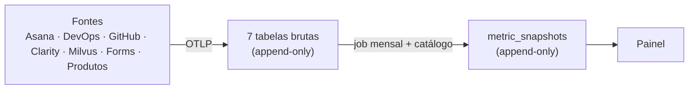

# Modelo de Dados — Base Central de Métricas BNP

**Versão:** rascunho para discussão · **Data:** 2026-07-13
**Backend:** TimescaleDB (PostgreSQL + hypertables) · **Ingestão:** OTLP (webhooks Asana/DevOps + emissão dos produtos)
**Princípios:** append-only · agnóstico a vendor · eventos brutos + cálculo mensal · owner por métrica/projeto

---

## 1. Visão geral

O modelo tem **três camadas**:

1. **Camada bruta (7 tabelas primárias)** — a fonte da verdade. Fatos imutáveis, agrupados pela *natureza do dado / papel da ferramenta*, não pelo vendor.
2. **Catálogo de métricas** (`metric_catalog`) — declara como cada métrica é derivada das tabelas brutas (filtro, agregação, owner, base teórica, bandas de maturidade).
3. **Read model** (`metric_snapshots`) — os valores mensais já calculados que o painel consome. Também append-only (cada recálculo gera um snapshot novo, versionado).



Dois **grãos** de dado bruto coexistem:

- **Evento (lifecycle):** fatos discretos correlacionados para derivar a métrica (ex.: lead time = `done` − `created`). Tabelas 1–4 e 7.
- **Medição (amostra periódica):** a fonte já entrega um valor agregado por janela (ex.: sessões/dia do Clarity). Tabelas 5–6.

Ambos casam com o OTLP: eventos ≈ *traces/logs*, medições ≈ *metrics*.

---

## 2. Envelope compartilhado

Todas as 7 tabelas partilham as mesmas colunas-base. Só as **colunas promovidas** mudam por domínio.

| Coluna | Tipo | Descrição |
|---|---|---|
| `event_id` | `TEXT PRIMARY KEY` | Chave única para **idempotência**. Id nativo da fonte quando existe; senão hash determinístico de (`source`,`external_id`,`event_type`,`occurred_at`). Ingestão faz `ON CONFLICT DO NOTHING`. |
| `source` | `TEXT NOT NULL` | Ferramenta/produto concreto: `asana`, `azure_boards`, `github_projects`, `clarity`, `milvus`, `escolas`... |
| `project` | `TEXT NOT NULL` | Chave canônica do projeto/produto. **Dimensão que toda métrica filtra.** |
| `occurred_at` | `TIMESTAMPTZ NOT NULL` | Quando o fato aconteceu. **Partition key** da hypertable. |
| `ingested_at` | `TIMESTAMPTZ NOT NULL DEFAULT now()` | Quando entrou na base (append). |
| `schema_version` | `SMALLINT NOT NULL DEFAULT 1` | Versão do contrato de evento daquela fonte. |
| `payload` | `JSONB NOT NULL` | Registro cru original — auditoria e recálculo retroativo. |

> **Append-only na prática:** sem `UPDATE`/`DELETE`. Correção de valor errado = novo evento compensatório (ou nova versão de snapshot), nunca edição da linha.

---

## 3. As 7 tabelas primárias (DDL)

### 3.1 `task_events` — gestão de trabalho
Ferramentas: Asana, Azure Boards, GitHub Projects, Jira, Linear, Trello.

```sql
CREATE TABLE task_events (
  event_id       TEXT PRIMARY KEY,
  source         TEXT NOT NULL,
  project        TEXT NOT NULL,
  occurred_at    TIMESTAMPTZ NOT NULL,
  ingested_at    TIMESTAMPTZ NOT NULL DEFAULT now(),
  schema_version SMALLINT NOT NULL DEFAULT 1,
  -- promovidas --
  task_id        TEXT NOT NULL,                 -- chave de correlação (lead/cycle time)
  event_type     TEXT NOT NULL,                 -- created | status_changed | done | reopened | removed | tested
  work_item_type TEXT,                          -- bug | pbi | tech_debt | feature | task
  value_tag      TEXT,                          -- evolucao | integracoes | nova_funcionalidade | NULL
  priority       TEXT,                          -- expedite | alta | media | baixa
  status         TEXT,                          -- backlog | priorizado | em_andamento | em_validacao | concluido
  from_status    TEXT,                          -- p/ status_changed (CFD e retrabalho)
  to_status      TEXT,
  tested         BOOLEAN,                        -- p/ PBI Tested Ratio
  environment_found TEXT,                        -- p/ bug: staging | producao (Falhas Evitadas / Efficiency)
  payload        JSONB NOT NULL
);
SELECT create_hypertable('task_events','occurred_at');
CREATE INDEX ON task_events (project, occurred_at DESC);
CREATE INDEX ON task_events (task_id);
```

**Deriva:** % Entregas Evolutivas, Entregas de Valor, Expedite, Backlog por Prioridade, Entrega ao Longo do Tempo, Lead Time, Cycle Time, Itens por Tipo, PBI Tested Ratio, Bugs×PBIs, Falhas Evitadas, Efficiency Ratio, Retrabalho.

> **Lead time** = `occurred_at(done)` − `occurred_at(created)` por `task_id`.
> **Cycle time** = `occurred_at(done)` − primeiro `to_status='em_andamento'`.
> **Retrabalho** = eventos `status_changed` cujo `to_status` regride para `em_andamento` após já ter passado por `em_validacao`.

### 3.2 `deployment_events` — entrega contínua
Ferramentas: Azure Pipelines, GitHub Actions, GitLab CI.

```sql
CREATE TABLE deployment_events (
  event_id       TEXT PRIMARY KEY,
  source         TEXT NOT NULL,
  project        TEXT NOT NULL,
  occurred_at    TIMESTAMPTZ NOT NULL,
  ingested_at    TIMESTAMPTZ NOT NULL DEFAULT now(),
  schema_version SMALLINT NOT NULL DEFAULT 1,
  -- promovidas --
  deployment_id  TEXT NOT NULL,
  event_type     TEXT NOT NULL,                 -- deploy_started | deploy_succeeded | deploy_failed
  environment    TEXT NOT NULL,                 -- producao | staging | homologacao
  status         TEXT,                          -- success | failed
  version_ref    TEXT,                          -- release/commit/tag
  payload        JSONB NOT NULL
);
SELECT create_hypertable('deployment_events','occurred_at');
CREATE INDEX ON deployment_events (project, occurred_at DESC);
```

**Deriva:** Frequência de Deploy (DORA), Tempo Médio de Deploy, e futuramente Change Failure Rate.

### 3.3 `ticket_events` — suporte / operação
Ferramentas: Milvus, Zendesk, Jira Service Management, ServiceNow, Freshdesk.

```sql
CREATE TABLE ticket_events (
  event_id       TEXT PRIMARY KEY,
  source         TEXT NOT NULL,
  project        TEXT NOT NULL,
  occurred_at    TIMESTAMPTZ NOT NULL,
  ingested_at    TIMESTAMPTZ NOT NULL DEFAULT now(),
  schema_version SMALLINT NOT NULL DEFAULT 1,
  -- promovidas --
  ticket_id          TEXT NOT NULL,
  event_type         TEXT NOT NULL,             -- opened | acknowledged | resolved | closed | reopened
  ticket_type        TEXT,                      -- incident | request
  severity           TEXT,                      -- sev1 | sev2 | sev3 | sev4
  priority           TEXT,
  category           TEXT,                      -- categoria_secundaria
  sla_target_minutes INTEGER,                    -- Sev1=240 Sev2=480 Sev3=720 Sev4=1440
  sla_status         TEXT,                      -- ok | violated (no evento resolved)
  payload            JSONB NOT NULL
);
SELECT create_hypertable('ticket_events','occurred_at');
CREATE INDEX ON ticket_events (project, occurred_at DESC);
CREATE INDEX ON ticket_events (ticket_id);
```

**Deriva:** % Requisições, % Incidentes, % SLA de Solução, Tempo Médio de Atendimento, Chamados por Prioridade/Categoria/Mês, Incidentes Críticos, MTTA/MTTR, SLA por Severidade.

> **MTTA** = `acknowledged` − `opened`; **MTTR** = `resolved` − `opened`, por `ticket_id`.

### 3.4 `survey_responses` — experiência / pesquisa
Ferramentas: Forms, Typeform, SurveyMonkey.

```sql
CREATE TABLE survey_responses (
  event_id       TEXT PRIMARY KEY,
  source         TEXT NOT NULL,
  project        TEXT NOT NULL,
  occurred_at    TIMESTAMPTZ NOT NULL,
  ingested_at    TIMESTAMPTZ NOT NULL DEFAULT now(),
  schema_version SMALLINT NOT NULL DEFAULT 1,
  -- promovidas --
  response_id    TEXT NOT NULL,
  dimension      TEXT,                          -- negocios | desenvolvimento | suporte | usabilidade | geral
  score          SMALLINT,                      -- 0..10
  respondent_ref TEXT,                          -- id anonimizado
  payload        JSONB NOT NULL
);
SELECT create_hypertable('survey_responses','occurred_at');
CREATE INDEX ON survey_responses (project, occurred_at DESC);
```

**Deriva:** NPS, NPS por Dimensão.
> **NPS** = (% promotores − % detratores) × 100, com promotor `score ≥ 9` e detrator `score ≤ 6`.

### 3.5 `usage_samples` — analytics de produto *(grão de medição)*
Ferramentas: Clarity, GA4, Mixpanel, Amplitude, bancos dos produtos (cadastros).

```sql
CREATE TABLE usage_samples (
  event_id       TEXT PRIMARY KEY,              -- hash(source,project,metric_key,occurred_at,window)
  source         TEXT NOT NULL,
  project        TEXT NOT NULL,
  occurred_at    TIMESTAMPTZ NOT NULL,          -- início da janela amostrada
  ingested_at    TIMESTAMPTZ NOT NULL DEFAULT now(),
  schema_version SMALLINT NOT NULL DEFAULT 1,
  -- promovidas --
  metric_key     TEXT NOT NULL,                 -- total_sessoes | usuarios_distintos | usuarios_retornados |
                                                -- tempo_medio_ativo | sessoes_por_usuario | sessoes_humanas | novos_cadastros
  value          NUMERIC NOT NULL,
  window         TEXT NOT NULL,                 -- day | month
  payload        JSONB NOT NULL
);
SELECT create_hypertable('usage_samples','occurred_at');
CREATE INDEX ON usage_samples (project, metric_key, occurred_at DESC);
```

**Deriva:** Total de Sessões, Usuários Retornados, Tempo Médio Ativo, Acessos por Usuário, Dias mais Acessados, Usuários Cadastrados.

### 3.6 `performance_samples` — desempenho / observabilidade *(grão de medição)*
Ferramentas: Clarity, Lighthouse, Datadog, APM.

```sql
CREATE TABLE performance_samples (
  event_id       TEXT PRIMARY KEY,
  source         TEXT NOT NULL,
  project        TEXT NOT NULL,
  occurred_at    TIMESTAMPTZ NOT NULL,
  ingested_at    TIMESTAMPTZ NOT NULL DEFAULT now(),
  schema_version SMALLINT NOT NULL DEFAULT 1,
  -- promovidas --
  metric_key     TEXT NOT NULL,                 -- apdex | lcp | fid | cls | perf_score
  value          NUMERIC NOT NULL,
  window         TEXT NOT NULL,                 -- day | month
  payload        JSONB NOT NULL
);
SELECT create_hypertable('performance_samples','occurred_at');
CREATE INDEX ON performance_samples (project, metric_key, occurred_at DESC);
```

**Deriva:** APDEX, Score de Performance (LCP / FID / CLS).

> **Nota:** 3.5 e 3.6 têm schema idêntico (só muda o domínio). Poderiam ser uma única tabela `measurement_samples` com coluna `domain`. Mantive separadas para respeitar o recorte "uma tabela por natureza"; decisão reversível.

### 3.7 `business_events` — eventos de negócio por produto *(ponto de extensão)*
Fonte: o próprio produto (app/DB), via webhook ou emissão OTLP.

```sql
CREATE TABLE business_events (
  event_id       TEXT PRIMARY KEY,
  source         TEXT NOT NULL,                 -- o próprio produto
  project        TEXT NOT NULL,
  occurred_at    TIMESTAMPTZ NOT NULL,
  ingested_at    TIMESTAMPTZ NOT NULL DEFAULT now(),
  schema_version SMALLINT NOT NULL DEFAULT 1,
  -- promovidas (deliberadamente genéricas) --
  event_name     TEXT NOT NULL,                 -- matricula_criada | projeto_aprovado | contrato_assinado
  entity_id      TEXT,                          -- id da entidade de negócio (opcional)
  value          NUMERIC,                       -- NULL p/ contagem; preenchido p/ medição (ex. R$)
  payload        JSONB NOT NULL                 -- atributos do domínio (escola, curso, turno...)
);
SELECT create_hypertable('business_events','occurred_at');
CREATE INDEX ON business_events (project, event_name, occurred_at DESC);
```

**Deriva:** métricas específicas por produto — matrículas/mês (Escolas), projetos aprovados (Fase.PRO), contratos assinados (Contratações Artísticas), GMV, etc.
Diferente das 6 transversais, o vocabulário muda por produto — por isso as colunas são genéricas e a semântica vive no **catálogo** (seção 4).

---

## 4. Catálogo de métricas (`metric_catalog`)

Sem o catálogo, `business_events` (e mesmo as tabelas transversais) são só um saco de fatos. O catálogo é a **camada semântica**: declara, para cada métrica, de onde ela sai e como se calcula. É a tabela que a área de negócio/PO alimenta ao "plugar" uma métrica.

```sql
CREATE TABLE metric_catalog (
  metric_key      TEXT PRIMARY KEY,             -- 'pct_entregas_evolutivas' | 'escolas.matriculas_mes'
  title           TEXT NOT NULL,
  scope           TEXT NOT NULL,                -- global (transversal) | product (específica)
  product         TEXT,                         -- NULL quando global
  source_table    TEXT NOT NULL,               -- qual das 7 tabelas
  event_filter    JSONB NOT NULL,              -- {"event_type":"done","value_tag":["evolucao","integracoes","nova_funcionalidade"]}
  aggregation     TEXT NOT NULL,               -- count | sum | avg | median | ratio | nps
  ratio_of        TEXT,                         -- p/ ratio: metric_key do denominador
  unit            TEXT,                         -- % | dias | h:mm | contagem | R$
  owner           TEXT NOT NULL,               -- owner por métrica/projeto (obrigatório)
  theory_ref      TEXT,                         -- 'Flow Framework' | 'DORA' | 'HEART' | 'ITIL v4'...
  maturity_bands  JSONB,                        -- {"alta":">=60","adequado":"45-59","atencao":"30-44","critico":"<30"}
  active          BOOLEAN NOT NULL DEFAULT true
);
```

Exemplos de linhas:

| metric_key | scope | source_table | aggregation | owner | theory_ref |
|---|---|---|---|---|---|
| `pct_entregas_evolutivas` | global | task_events | ratio | Karine | Flow Framework |
| `lead_time_medio` | global | task_events | avg | Luigi | Lean / Value Stream |
| `frequencia_deploy` | global | deployment_events | count/dias | Eng | DORA |
| `nps` | global | survey_responses | nps | Karine | NPS (Reichheld) |
| `pct_sla_solucao` | global | ticket_events | ratio | Suporte | ITIL v4 |
| `apdex` | global | performance_samples | avg | Eng | Apdex / IEEE |
| `escolas.matriculas_mes` | product | business_events | count | PO Escolas | — |

> O catálogo **não** é append-only — é configuração viva. Mas ganha um `formula_version` implícito: mudou a definição, os snapshots seguintes registram a nova versão (seção 5), preservando o histórico já calculado.

---

## 5. Read model (`metric_snapshots`)

A tabela de "valores prontos" que você descreveu. O job mensal lê as tabelas brutas + o catálogo, calcula e **anexa** um snapshot. Nunca sobrescreve — "julho recalculado em agosto" convive com "julho como estava em julho".

```sql
CREATE TABLE metric_snapshots (
  snapshot_id     TEXT PRIMARY KEY,
  metric_key      TEXT NOT NULL REFERENCES metric_catalog(metric_key),
  project         TEXT NOT NULL,
  period          TEXT NOT NULL,                -- '2026-07' (mensal)
  value           NUMERIC NOT NULL,
  maturity_level  TEXT,                          -- alta | adequado | atencao | critico
  confidence      NUMERIC,                       -- índice de confiança por métrica (0..1)
  formula_version INTEGER NOT NULL,              -- reprodutibilidade
  computed_at     TIMESTAMPTZ NOT NULL DEFAULT now()
);
CREATE INDEX ON metric_snapshots (metric_key, project, period, computed_at DESC);
```

O painel consome sempre o snapshot mais recente por (`metric_key`,`project`,`period`). O **índice de confiança** e o **versionamento de fórmula** (ambos previstos na iniciativa) nascem naturais aqui.

---

## 6. Rastreabilidade — indicador do painel → tabela

| Página | Indicador | Tabela fonte | Grão |
|---|---|---|---|
| 1 Evolução | % Entregas Evolutivas, Entregas de Valor, Expedite, Backlog, Entrega no tempo | `task_events` | evento |
| 2 Experiência | Sessões, Usuários Retornados, Tempo Ativo, Acessos/Usuário, Dias acessados | `usage_samples` | medição |
| 2 Experiência | Usuários Cadastrados | `usage_samples` (ou `business_events`) | medição/evento |
| 2 Experiência | APDEX | `performance_samples` | medição |
| 2 Experiência | NPS, NPS por Dimensão | `survey_responses` | evento |
| 3 Eficiência | Frequência de Deploy, Tempo de Deploy | `deployment_events` | evento |
| 3 Eficiência | Lead Time, Cycle Time, Itens por Tipo, PBI Tested Ratio, Efficiency Ratio, Falhas Evitadas, Bugs×PBIs | `task_events` | evento |
| 4 Operacional | % Requisições, % Incidentes, % SLA, MTTA/MTTR, Chamados, Incidentes Críticos, SLA por Severidade | `ticket_events` | evento |
| 5 Desempenho | Score de Performance (Core Web Vitals) | `performance_samples` | medição |
| — | Métricas específicas de produto (matrículas, projetos aprovados...) | `business_events` | evento |

---

## 7. Decisões e pontos em aberto

**Decidido neste desenho:**
- 6 tabelas transversais por natureza + `business_events` como extensão por produto = **7 primárias**.
- Envelope OTLP compartilhado; idempotência via `event_id`; append-only estrito.
- Bugs por ambiente = atributo (`environment_found`) em `task_events`, não tabela separada.
- Catálogo separado das tabelas brutas; snapshots mensais versionados como read model.

**Em aberto:**
- Unificar `usage_samples` + `performance_samples` numa `measurement_samples` com coluna `domain`? (reversível)
- Cadastros de usuário: evento por cadastro (`business_events`) ou amostra de contagem (`usage_samples`)? Depende do acesso ao DB de cada produto.
- Governança do append-only: quem pode emitir evento compensatório e como auditar.
- Camada humana sobre o OTLP (form web / SDK / CLI) para as métricas sem fonte automatizável.
